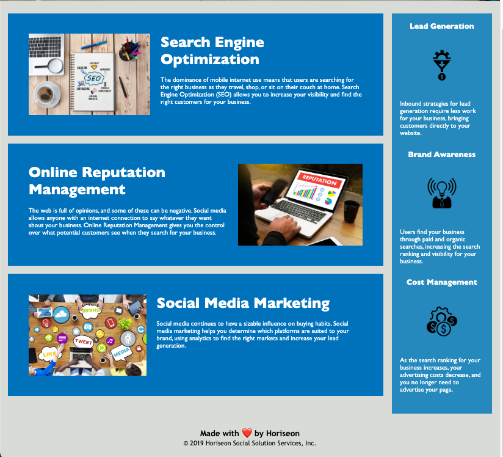

# Code-Refactor

## Description 

The following is a README generated as practice for a coding bootcamp challenge assignment.

The [Horiseon Social Solution Services Langing Page](mattdack.github.io/code-refactor), describes the services that Horiseon provides and the benefits that those services lead to. The webpage utilizes semantic HTML:5 and CSS to aesthetically lay out stock photos, descriptions of Horiseon services/benefits, and provide alternative text for accessibility standards. Emmbedded links in the navigation bar move the user to the specific section on the webpage that describes them. With this webpage, Horiseon is well equipped to market their services to potential customers.

> **Note**: This layout is designed for desktop viewing, so you may notice that some of the elements don't look like the mock-up at a resolution smaller than 768px. 

## Screenshot of Webpage

## Installation

There is no installation required or capable with this repository. Running the index.html file in a default browser renders a static webpage that is identical to the one found at [here](mattdack.github.io/code-refactor).

## Usage 

Select the links in the header navigation bar to move to main sections on the webpage. Right-click on photos embedded in the webpage to view the alternative text associated with them.

## Credits

The majority of the code for this project was provided by Trilogy in collaboration with the University of Washington. Matthew Dacanay performed a code refactoring to improve the html5 and css semantics and accessibility to the webpage. You can find other projects by Matthew at his [github page](github.com/mattdack).
